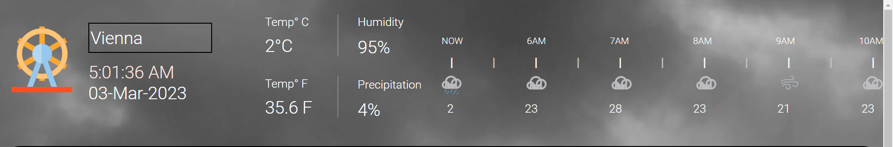
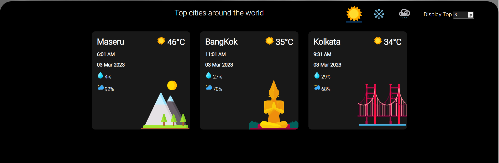
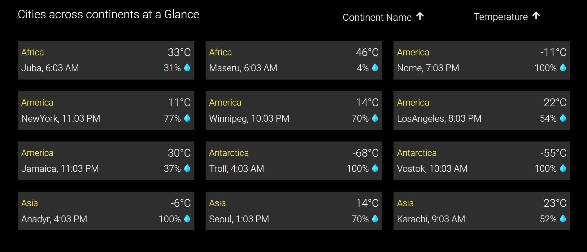

# Title: Weather Application

## Description

The application displays the weather details for major cities on an hourly basis. It is a fully responsive website that displays the weather across various cities.

---

_Technology Stack_

---

# Features

    Task 1: Weather Information for selected city
    

    Task 2: Weather condition for all listed cities based on sunny, rainy or snowy
    

    Task 3: Content wise weather condition for the list of cities (sorted based on continent name and temperature)
    

---

# IDE used

---

# Links

[Bit bucket](https://bitbucket.org/reenasajad/reena_webtips_assignments/src/master/)

---

### Instructions to run the App on Node

Step 1: Install Node
Step 2: Install all the dev dependencies specified in package.json using npm install
Step 3: Run the command "node server"

---
